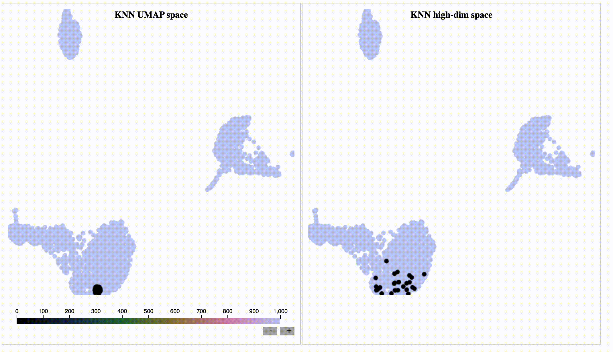

# KNN Sleepwalk

## Introduction, the problem
This package builds off of the sleepwalk R package, which you can find  [here](https://anders-biostat.github.io/sleepwalk/). In short, rather than "walking" through your embedding to visualize distances between cells, you are visualizing the literal K-nearest neighbors of a given cell that the cursor is on, either from the emebdding space, or from the original high dimensional data.

The motivation for this wrapper comes from previous work I've done on the quality of dimension reduction embeddings for cytometry data, which you can view [here](https://tjburns08.github.io/tjb_dimr_talk.pdf). Simply put, some users in the cytometry field like to gate or cluster directly on the embeddings. This re-working of sleepwalk allows these users to gain additional intuition around whether this is a good idea for the data in question and/or a particular cell subset.  

## Installation
In R, please run the following command:
```r
devtools::install_github("tjburns08/KnnSleepwalk")
```

## Usage
The package comes with an example dataset, so you can get a feel for what to do. You need to have your embedding (in the example case, we have a umap), and your original high-dimensional data, filtered by the markers that you ran the umap on (these are typically surface markers, and accordingly, our example dataset is called "surface"). 

First, load the data
```r
library(KnnSleepwalk)
data("example_umap")
data("example_surface_markers")
```

Test to make sure the data are present. Both should be tibbles.
```r
surface # Orignal marker space
umap # UMAP
```
Now we run KNN sleepwalk:

```r
KnnSleepwalk(embedding = umap, orig_data = surface, k = 20)
```

When you run sleepwalk, a browser window will open up with the interactive embedding. The more cells you have, the longer it will take for the map to show up in the browser window. There will be a lag time where the browser window is blank. When you test this tool for the first time, run it with a subsample of 1000 cells. In my experience, 10000 cells with a k of 100 gives you the intuition you need. Note also that the console will say "server has been stopped." That doesn't mean that the tool failed. In my experience, the interactive map works just fine despite this message. You can see an example of the output below.



## Additional notes
In the current implementation, the nearest neighbors are computed using Euclidean distance. Future versions of this software will have additional metrics, like cosine distance.

## Acknowledgements
Sofie VanGassen for making me aware of the sleepwalk package. Marie Burns for providing the data used in the demo. AG Mei and AG Grutzkau at the German Rheumatism Research Center for providing feedback and data in the earlier stages of this project (see the slide deck I linked above).
